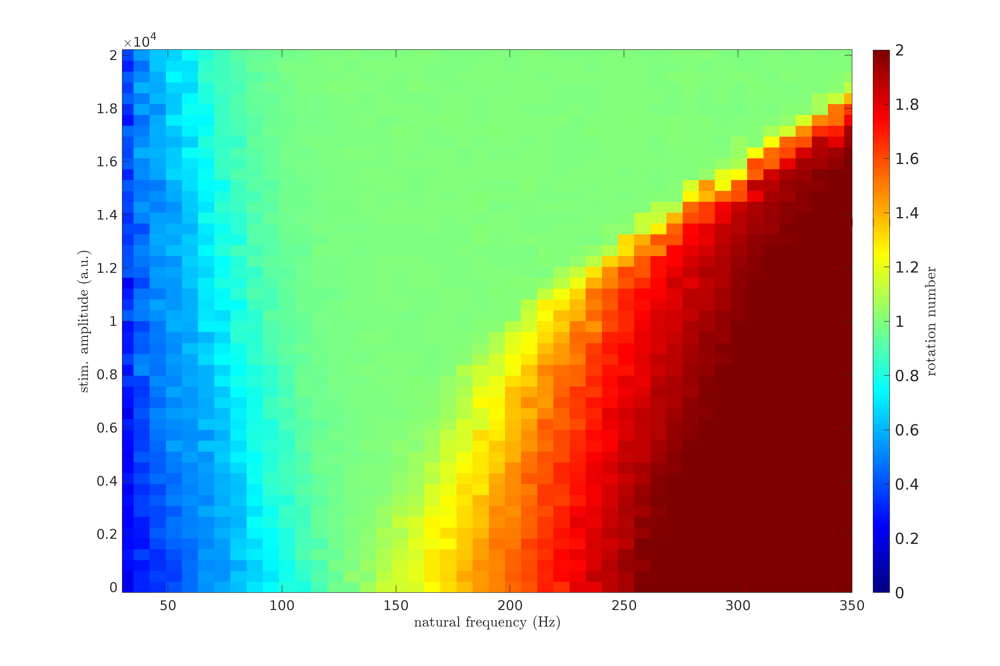
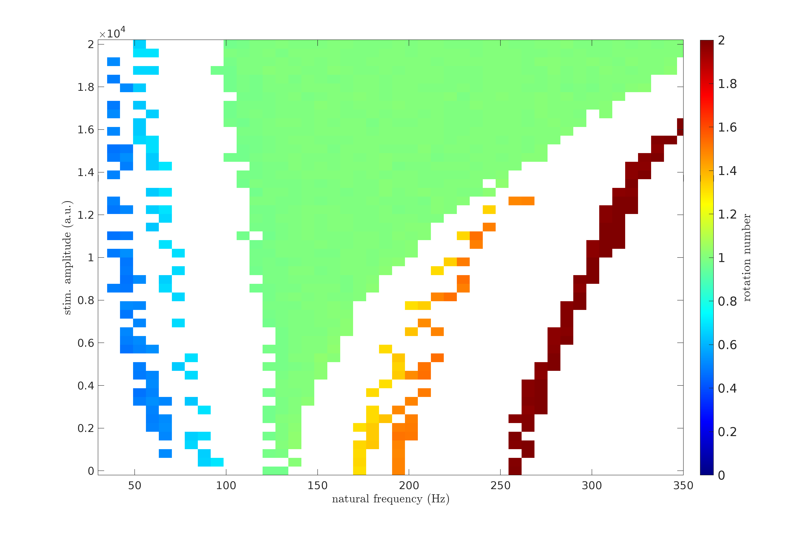
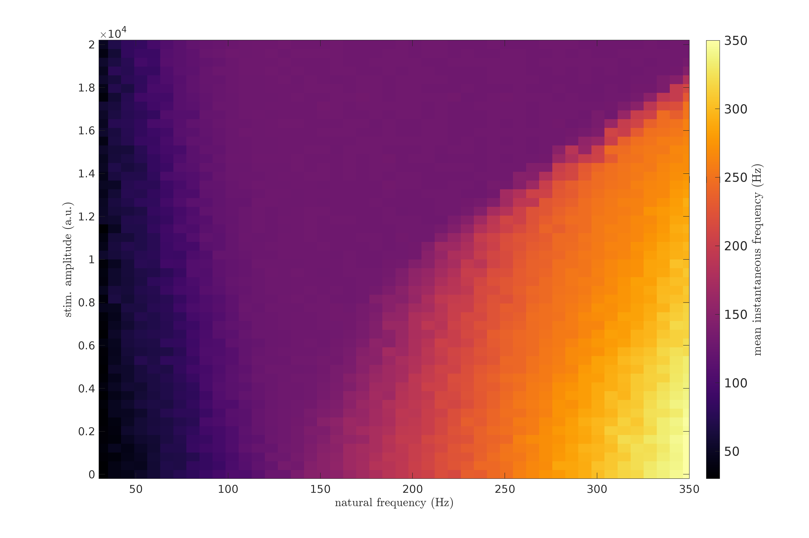
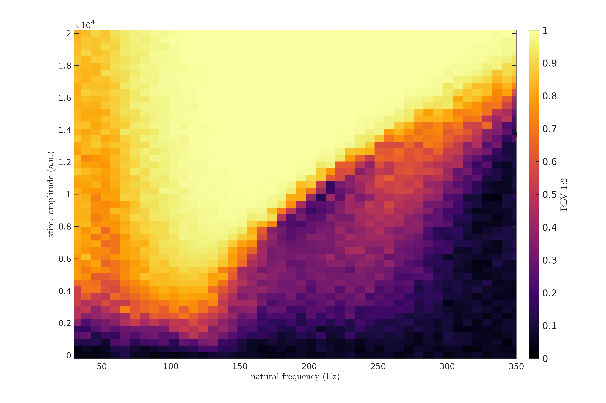
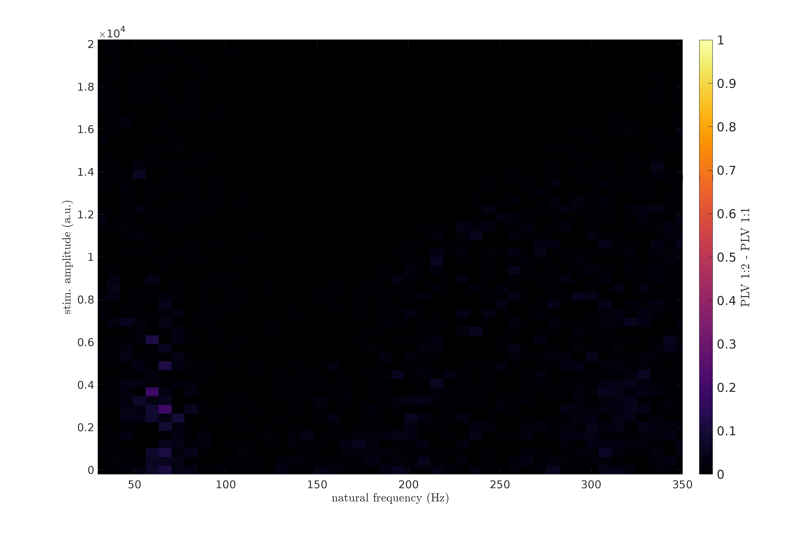
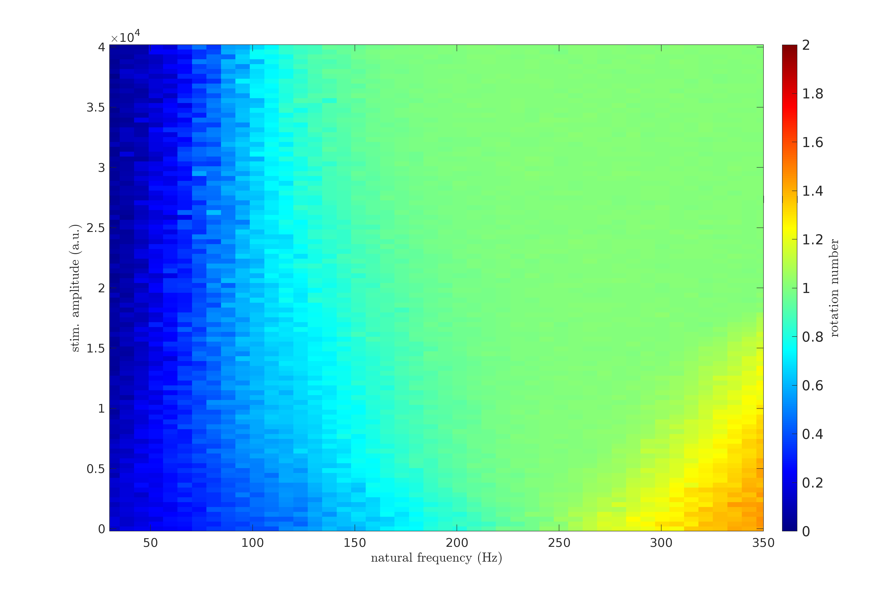
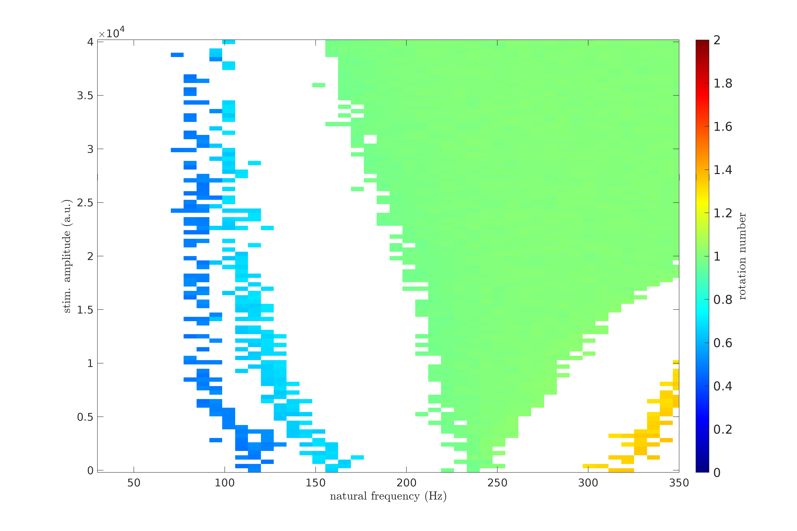
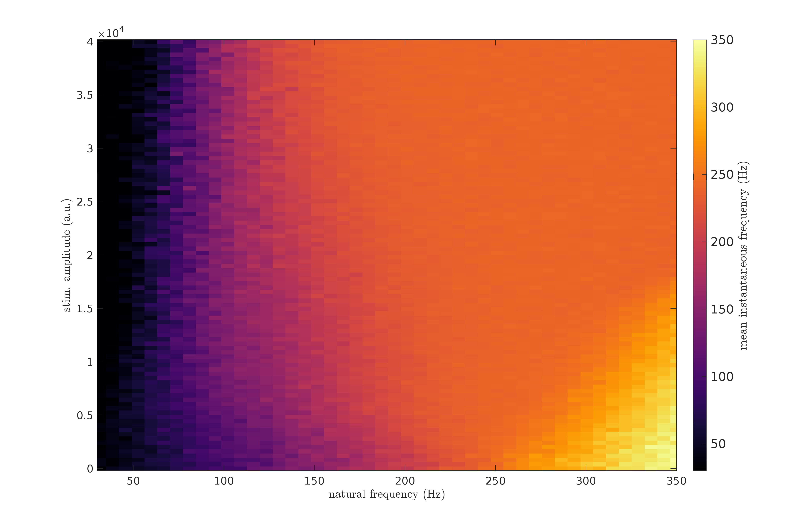
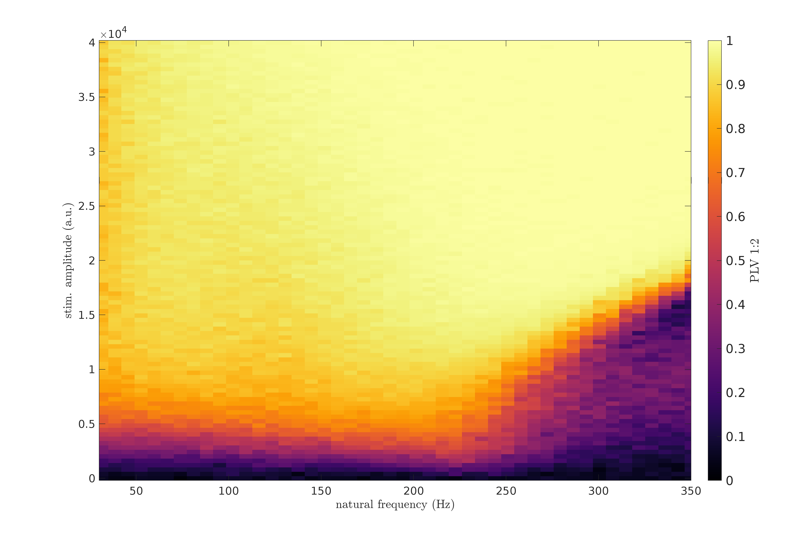
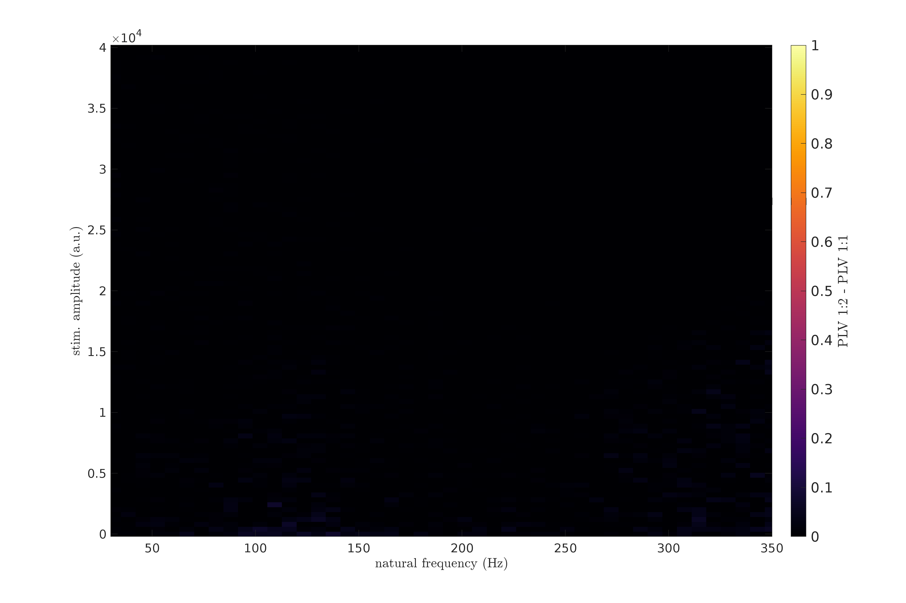

# KM_Plot explained
## Running Steps
* Step 1: Change parameters in testCall.m file and run it. Wait until the running is complete. The result is saved in workspace.mat file.
* Step 2: Run reading_slopeBased.m file. The results are saved in Fig folder.

## Changed Figures
### Parameters 1
```bash
fpath       = 'test';   %path to save output
k           = 350;      %coupling strength
delta_f_0   = 20;       %width of the Lorentzian distribution of natural frequencies
xi          = 7.9;      %model noie standard deviation
a_max       = 2E4;      %maximum stimulation amplitude value
n_a         = 50;       %number of stimulation amplitude values to consider
f0_min      = 3;        %minimum natural frequency value
f0_max      = 350;      %maximum natural frequency value
n_f0        = 50;       %number of natural frequency values to consider
zeta        = 0.15;     %dithering level
PRCfName    = 'HH_PRC'; %name of the PRC file
N           = 50;       %number of oscillators
n_tr        = 3;        %number of trials to average over for a given value of natural frequency, stimulation amplitude, and dithering
n_pulses    = 400;      %number of stimulation pulses in a given trial
dt          = 1E-4;     %integration time step
f_stim      = 130;      %stimulation frequency
freqSet     = "[]";     %set of frequencies to toggle from (leave as "[]" for dithering) - see use cases in KM_wrapper.m    
n_same      = 1;        %number of consecutive stimulation periods at the same stimulation frequency (only works for toggling) - see use cases in KM_wrapper.m
rndCycling  = false;    %set to true for random cycling in the toggling approach (only works for toggling) - see use cases in KM_wrapper.m  
```
<div style="display: grid; grid-template-columns: repeat(3, 1fr); gap: 10px;">
    
    
    
    
    
    
</div>

## Parameters 2
```bash
fpath       = 'test';   %path to save output
k           = 350;      %coupling strength
delta_f_0   = 20;       %width of the Lorentzian distribution of natural frequencies
xi          = 15.9;      %model noie standard deviation
a_max       = 4E4;      %maximum stimulation amplitude value
n_a         = 100;       %number of stimulation amplitude values to consider
f0_min      = 3;        %minimum natural frequency value
f0_max      = 350;      %maximum natural frequency value
n_f0        = 50;       %number of natural frequency values to consider
zeta        = 0.15;     %dithering level
PRCfName    = 'HH_PRC'; %name of the PRC file
N           = 50;       %number of oscillators
n_tr        = 3;        %number of trials to average over for a given value of natural frequency, stimulation amplitude, and dithering
n_pulses    = 400;      %number of stimulation pulses in a given trial
dt          = 1E-4;     %integration time step
f_stim      = 240;      %stimulation frequency
freqSet     = "[]";     %set of frequencies to toggle from (leave as "[]" for dithering) - see use cases in KM_wrapper.m    
n_same      = 1;        %number of consecutive stimulation periods at the same stimulation frequency (only works for toggling) - see use cases in KM_wrapper.m
rndCycling  = false;    %set to true for random cycling in the toggling approach (only works for toggling) - see use cases in KM_wrapper.m  
```
<div style="display: grid; grid-template-columns: repeat(3, 1fr); gap: 10px;">
    
    
    
    
    
    
</div>